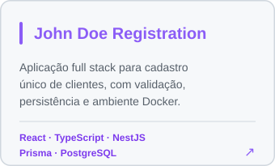
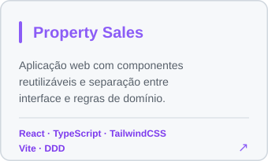
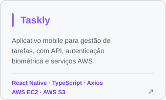

  <h1>Jessica Woytuski</h1>

  

    <strong>Desenvolvedora Full Stack</strong> 
    React · React Native · TypeScript · Node.js · NestJS · AWS
  

  

   

  

    
    &nbsp;
    
    &nbsp;
    
  

<h2>Sobre mim</h2>

  Sou <strong>Desenvolvedora Full Stack</strong> com experiência no desenvolvimento de aplicações
  web e mobile, atuando com frontend, backend, cloud e automação de entrega.

  Trabalho principalmente com <strong>React, React Native, Next.js, TypeScript, Node.js e NestJS</strong>,
  aplicando práticas como <strong>DDD, SOLID, Clean Code, Atomic Design, Design System,
  testes automatizados e CI/CD</strong>.

<h2>Stack principal</h2>

  
  
  
  
  
  

  
  
  
  

  
  
  
  
  

  
  
  
  

<h2>Projetos em destaque</h2>

  

    
    
  

  

    
  

    

  

<h2>Aprendizado contínuo</h2>

  Além da atuação com desenvolvimento web e mobile, sigo aprofundando conhecimentos em
  frontend, arquitetura de aplicações e boas práticas de engenharia de software.

  Atualmente participo do <a href="https://sctec.scti.sc.gov.br/"><strong>SCTEC</strong></a>,
  programa do Estado de Santa Catarina, por meio da SCTI e em parceria com o SENAI/SC,
  na turma <strong>Desenvolvedor Front-End Angular</strong>, segundo ciclo da trilha
  <strong>Carreira Tech</strong>.

<h2>AI-assisted Development</h2>

  Utilizo ferramentas de IA como apoio ao desenvolvimento, análise de código,
  engenharia de prompts, automação de tarefas e produtividade.

  
  

<h2>Formação</h2>

  <strong>Análise e Desenvolvimento de Sistemas</strong> 
  Universidade do Sul de Santa Catarina — UNISUL

  

    <strong>Aberta a conexões, colaboração e oportunidades em desenvolvimento Full Stack.</strong>
  

  

    <a href="https://www.linkedin.com/in/jessica-woytuski">LinkedIn</a>
    &nbsp;·&nbsp;
    <a href="https://github.com/Jessiwoy">GitHub</a>
    &nbsp;·&nbsp;
    <a href="mailto:jessica.w.dev@gmail.com">Email</a>
  

